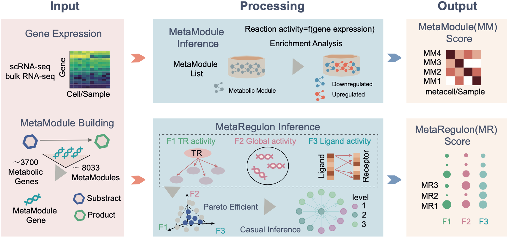

.. MetroSCREEN documentation master file, created by
   sphinx-quickstart on Tue Apr 16 18:36:25 2024.
   You can adapt this file completely to your liking, but it should at least
   contain the root `toctree` directive.

Welcome to MetroSCREEN's documentation!
===================================

.. toctree::
   :maxdepth: 2
   :caption: Contents:

|PyPI| |Docs|

.. |PyPI| image:: https://img.shields.io/pypi/v/MetroSCREEN
   :target: https://pypi.org/project/MetroSCREEN
.. |PyPIDownloads| image:: https://pepy.tech/badge/MetroSCREEN
.. |Docs| image:: https://readthedocs.org/projects/MetroSCREEN/badge/?version=latest
   :target: https://MetroSCREEN.readthedocs.io

Metabolite and their associated extrinsic and intrinsic regulators screening based on transcriptomic data(**MetroSCREEN**).
MetroSCREEN is a computational tool designed to deduce metabolic states (MetaModule function) and identify upstream extrinsic and intrinsic regulators (MetaRegulon function) that influence dysregulated metabolic reactions, utilizing either scRNA-seq or bulk data.

.. include:: release_notes/1.0.0.rst

.. toctree::
   :maxdepth: 1
   :hidden:

   installation
   tutorials
   release_notes/index

