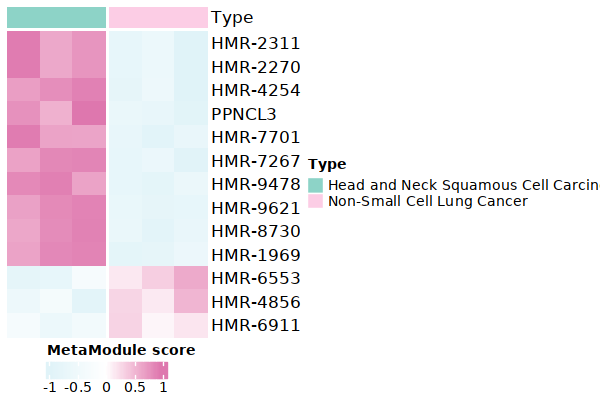
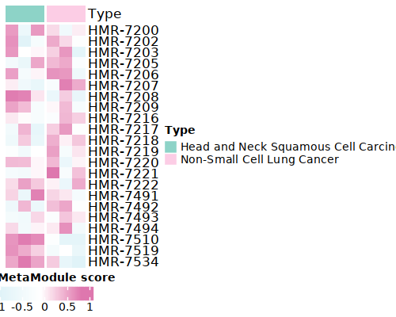

.. highlight:: shell

.. role:: bash(code)
   :language: bash

MetroSCREEN(RNA-seq)
---------------------------------

For bulk RNA-seq data, MetroSCREEN calculates the MetaModule score for each sample and then builds a MetaRegulon for each dysregulated MetaModule, which provides insights into the mechanisms of metabolic regulation. Besides, MetroSCREEN delineates the direction and source of the MetaRegulon.

Here we used six cell lines of `Cancer Cell Line Encyclopedia (CCLE) <https://sites.broadinstitute.org/ccle/>`_ dataset to demonstrate the usage of the MetaModule function and MetaRegulon function of MetroSCREEN. Users can download the data and the information from `here <https://github.com/wanglabtongji/Cellist/tree/main/test/Stereoseq_Mouse_OB>`_. For users, they may have their own treat and control data. 

Step 1 MetaModule analysis
>>>>>>>>>>>>>>>>>>>>>>>>>>>>>>>>>>>>>>>>

^^^^^^^^^^^^^^^^^^^^^^^^^^^^^^^^^^^^^^^^^^^^^^^^^^^^^^^^
1. Calculate the MetaModule score
^^^^^^^^^^^^^^^^^^^^^^^^^^^^^^^^^^^^^^^^^^^^^^^^^^^^^^^^

Calculate the MetaModule score using the :bash:`cal_MetaModule` function. Users can utilize the reactions and corresponding information provided by `Recon3 <https://www.nature.com/articles/nbt.4072>`_. Since some of this information is duplicated, users can use the simplified version provided by MetroSCREEN. Alternatively, users can manually create and use gene sets of interest. It's should be noted that to each group shold included three samples at least.

.. code-block:: r

   ## MM: contains reaction lists of the genes
   MM=readRDS("/fs/home/tangke/metabolism/tool/data/MM.nodup.rds")

   ## MM.meta: metabolic information of these reacrions
   MM.meta=readRDS("/fs/home/tangke/metabolism/tool/data/MM.meta.rds") %>%
         as.data.frame()
   rownames(MM.meta)=MM.meta$ID

   MM[1:2]
   # $`HMR-0154`
   # 'ACOT7''ACOT2''ACOT9''BAAT''ACOT4''ACOT1''ACOT6'
   # $`HMR-0189`
   # 'ACOT7''ACOT2''BAAT''ACOT4''ACOT1''ACOT6'

   MM.meta[1:3,]
   #	ID	NAME	EQUATION	EC-NUMBER	GENE ASSOCIATION	LOWER BOUND	UPPER BOUND	OBJECTIVE	COMPARTMENT	MIRIAM	SUBSYSTEM	REPLACEMENT ID	NOTE	REFERENCE	CONFIDENCE SCORE
   # <lgl>	<chr>	<chr>	<chr>	<chr>	<chr>	<lgl>	<lgl>	<lgl>	<lgl>	<chr>	<chr>	<lgl>	<lgl>	<chr>	<dbl>
   # HMR-0154	NA	HMR-0154	NA	H2O[c] + propanoyl-CoA[c] => CoA[c] + H+[c] + propanoate[c]       	3.1.2.2	ENSG00000097021 or ENSG00000119673 or ENSG00000123130 or ENSG00000136881 or ENSG00000177465 or ENSG00000184227 or ENSG00000205669	NA	NA	NA	NA	sbo/SBO:0000176	Acyl-CoA hydrolysis	NA	NA	PMID:11013297;PMID:11013297	0
   # HMR-0189	NA	HMR-0189	NA	H2O[c] + lauroyl-CoA[c] => CoA[c] + H+[c] + lauric acid[c]        	3.1.2.2	ENSG00000097021 or ENSG00000119673 or ENSG00000136881 or ENSG00000177465 or ENSG00000184227 or ENSG00000205669                   	NA	NA	NA	NA	sbo/SBO:0000176	Acyl-CoA hydrolysis	NA	NA	NA                         	0
   # HMR-0193	NA	HMR-0193	NA	H2O[c] + tridecanoyl-CoA[c] => CoA[c] + H+[c] + tridecylic acid[c]	3.1.2.2	ENSG00000097021 or ENSG00000119673 or ENSG00000136881 or ENSG00000177465 or ENSG00000184227 or ENSG00000205669                   	NA	NA	NA	NA	sbo/SBO:0000176	Acyl-CoA hydrolysis	NA	NA	NA                         	0

In this section, MetroSCREEN calculates the MetaModule score for each metacell by using :bash:`cal_MetaModule` function. To identify differentially enriched MetaModules for each identity class in a dataset, the :bash:`FindAllMarkers_MetaModule` function from MetroSCREEN will be used. This function is similar to the  :bash:`FindAllMarkers` function in `Seurat <https://satijalab.org/seurat/>`_, allowing users use the similar parameters. The results of :bash:`cal_MetaModule` will be stored in the :bash:`/fs/home/tangke/metabolism/tool/data/` floder

.. code-block:: r

   ## Calculate the MetaModule score
   cal_MetaModule(metacell,MM,'/fs/home/tangke/metabolism/tool/data/CCLE/','ccle_gsva')
   ccle.gsva=readRDS('/fs/home/tangke/metabolism/tool/data/CCLE/ccle_gsva.rds')

   ## Read the sample information object for each metacell
   sample_info<-readRDS('/fs/home/tangke/metabolism/tool/data/CCLE/ccle_meta.rds')

   head(sample_info)

   # NCIH2106Non-Small Cell Lung CancerUPCISCC040Head and Neck Squamous Cell CarcinomaUPCISCC074Head and Neck Squamous Cell CarcinomaUPCISCC200Head and Neck Squamous Cell CarcinomaNCIH1155Non-Small Cell Lung CancerNCIH1385Non-Small Cell Lung Cancer
   # Levels:
   # 'Head and Neck Squamous Cell Carcinoma''Non-Small Cell Lung Cancer'

   ## Find the differentially enriched MetaModule for each of the identity classes in a dataset
   MetaModule.markers=FindAllMarkers_MetaModule(ccle.gsva,sample_info,'bulk')  
   MetaModule.markers$metabolic_type=MM.meta[MetaModule.markers$gene,'SUBSYSTEM']
   MetaModule.markers$reaction=MM.meta[MetaModule.markers$gene,'EQUATION']

   head(MetaModule.markers)

   # p_val	avg_log2FC	pct.1	pct.2	p_val_adj	cluster	gene	metabolic_type	reaction
   # <dbl>	<dbl>	<dbl>	<dbl>	<dbl>	<fct>	<chr>	<chr>	<chr>
   # HMR-4843	3.755633e-05	2.730885	1	0	0.06418377	Head and Neck Squamous Cell Carcinoma	HMR-4843	Transport reactions	GDP[c] + GTP[m] <=> GDP[m] + GTP[c]                                                      
   # HMR-1969	9.059557e-05	2.891705	1	0	0.15482783	Head and Neck Squamous Cell Carcinoma	HMR-1969	Androgen metabolism	dehydroepiandrosterone[c] + PAPS[c] => dehydroepiandrosterone sulfate[c] + H+[c] + PAP[c]
                  

   saveRDS(MetaModule.markers,'/fs/home/tangke/metabolism/tool/data/CCLE/ccle_gsva_markers.rds')

^^^^^^^^^^^^^^^^^^^^^^^^^^^^^^^^^^^^^^^^^^^^^^^^^^^^^^^^
2. Exploration of MetaModule score
^^^^^^^^^^^^^^^^^^^^^^^^^^^^^^^^^^^^^^^^^^^^^^^^^^^^^^^^

After the MetaModule calculation, users can explore the MetaModule score. Here, we give two examples for the following analysis.

.. code-block:: r

   ## show the top 10 most enriched MetaModule for each cell type
   top10<- MetaModule.markers %>%
      group_by(cluster) %>%
      arrange(desc(avg_log2FC), .by_group = TRUE) %>%
      slice_head(n = 10) %>%
      ungroup()

   doheatmap_feature(ccle.gsva,sample_info,top10$gene,6,4,cols=c('Head and Neck Squamous Cell Carcinoma'='#8DD3C7','Non-Small Cell Lung Cancer'='#FCCDE5'))

If users are interested in a specific pathway and want to identify the detailed reactions that differentiate various groups, they can exclusively set the pathways.

.. code-block:: r

   doheatmap_feature(ccle.gsva,sample_info,MM.meta[MM.meta$SUBSYSTEM=='Chondroitin / heparan sulfate biosynthesis','ID'],5,4,
                 cols=c('Head and Neck Squamous Cell Carcinoma'='#8DD3C7','Non-Small Cell Lung Cancer'='#FCCDE5'))

Step 3 MetaRegulon analysis
>>>>>>>>>>>>>>>>>>>>>>>>>>>>>>>>>>>>>>>>

Blocking a metabolic pathway is challenging due to the complex and poorly understood regulations of the metabolic processes.  MetroSCREEN systematically considers the combined effects of intrinsic cellular drivers and extrinsic environmental factors of metabolic regulation.

^^^^^^^^^^^^^^^^^^^^^^^^^^^^^^^^^^^^^^^^^^^^^^^^^^^^^^^^
1. Prepare the essential files for the dwonstream analysis
^^^^^^^^^^^^^^^^^^^^^^^^^^^^^^^^^^^^^^^^^^^^^^^^^^^^^^^^

.. code-block:: r

   ## Find the marker genes for each state of the metacell object
   metacell.seurat<-readRDS('/fs/home/tangke/metabolism/tool/data/fibro_new_metacell_seurat.rds')
   metacell.seurat.markers <- FindAllMarkers(metacell.seurat, only.pos = TRUE)
   ## Here, we choose the genes with the p_val_adj<0.05
   metacell.seurat.markers=metacell.seurat.markers[metacell.seurat.markers$p_val_adj<0.05,]
   saveRDS(metacell.seurat.markers,'/fs/home/tangke/metabolism/tool/data/fibro_new_metacell_gene_markers.rds')

Prepare the lisa results for each state.

.. code-block:: r

   ## Here, MetroSCREEN utilized the top 500 genes to find the enriched TFs in each state.
   for (i in unique(metacell.seurat.markers$cluster)){
      df=metacell.seurat.markers[metacell.seurat.markers$cluster==i,]
      if (nrow(df)>500){
         genes=df[,'gene'][1:500]
      } else{
         genes=df[,'gene']
      }
      
   write.table(genes,paste0('/fs/home/tangke/metabolism/tool/data/lisa/',i,':marker.txt'),
      sep='\t',
      quote=F,
      row.names=FALSE,
      col.names=FALSE)
   }

::

   lisa multi hg38 /fs/home/tangke/metabolism/tool/data/lisa/*.txt -b 501 -o ./

By the way, this step provides the TRs enriched in each step, allowing users to explore them as needed.

^^^^^^^^^^^^^^^^^^^^^^^^^^^^^^^^^^^^^^^^^^^^^^^^^^^^^^^^
2. Calculate the MetaRegulon score
^^^^^^^^^^^^^^^^^^^^^^^^^^^^^^^^^^^^^^^^^^^^^^^^^^^^^^^^

