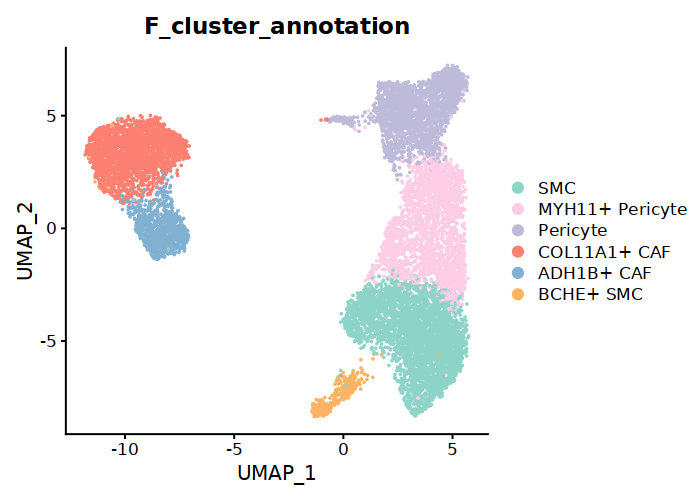
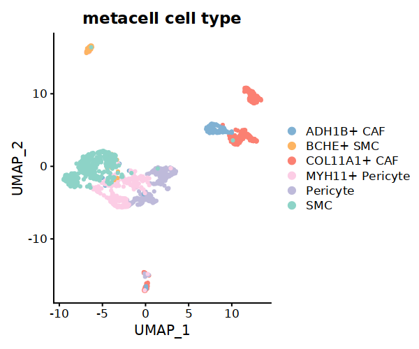
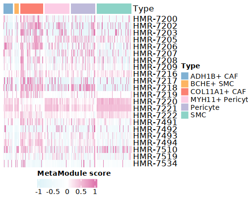

.. highlight:: shell

.. role:: bash(code)
   :language: bash

MetroSCREEN(scRNA-seq)
---------------------------------

For single-cell data, to mitigate the impact of technical noise and increase gene coverage, MetroSCREEN adopts a metacell strategy similar to `TabulaTIME <https://github.com/wanglabtongji/TabulaTiME>`_. MetroSCREEN calculates the MetaModule score for each metacell and then builds a MetaRegulon for each dysregulated MetaModule, which provides insights into the mechanisms of metabolic regulation. Besides, MetroSCREEN delineates the direction and source of the MetaRegulon.

Here we used a well annotated dataset to demonstrate the usage of the MetaModule function and MetaRegulon function of MetroSCREEN. The original study provide the gene expression and cell annotation. Users can download the data and the information from `here <https://github.com/wanglabtongji/Cellist/tree/main/test/Stereoseq_Mouse_OB>`_.

Step 1 Prepare the metacell
>>>>>>>>>>>>>>>>>>>>>>>>>>>>>>>>>>>>>>>>>>>>>>>>>>>>>>>>>>>>>>>>>>>

To mitigate the impact of technical noise and increase gene coverage, MetroSCREEN adopts a metacell strategy using :bash:`make_metacell` function. The number of cells in a metacell depends on the total number of cells. If the total exceeds 3000, the recommended number of cells per metacell is 30. For smaller cell populations, users can set a lower number of cells per metacell, but it should not be less than 10.

.. code-block:: r
   
   Fibro.seurat <- readRDS('/fs/home/tangke/metabolism/tool/data/fibro_new.rds')
   options(repr.plot.width = 7, repr.plot.height = 5,repr.plot.res = 100)
   DimPlot(Fibro.seurat, reduction = "umap",group.by='F_cluster_annotation',cols=c('SMC'='#8DD3C7','MYH11+ Pericyte'='#FCCDE5','Pericyte'='#BEBADA','COL11A1+ CAF'='#FB8072','ADH1B+ CAF'='#80B1D3','BCHE+ SMC'='#FDB462'))

.. code-block:: r

   ## Set the split with the cell type information
   Fibro.seurat$split=paste0(Fibro.seurat$F_cluster_annotation) 

   ## Construct the metacell
   make_metacell(Fibro.seurat,'split',10,'/fs/home/tangke/metabolism/tool/data/','fibro_new_metacell') 

   ## metacell object can be read
   metacell<-readRDS('/fs/home/tangke/metabolism/tool/data/fibro_new_metacell.rds')

   ## The rows of the metacell are the genes, while the columns of the metacell are the cell type information. 
   metacell[1:3,1:6]

   # COL11A1+ CAF|2|1	COL11A1+ CAF|2|2	COL11A1+ CAF|2|3	COL11A1+ CAF|2|4	COL11A1+ CAF|2|5	COL11A1+ CAF|2|6
   # A1BG	0.000000	0.000000	0.000000	0.000000	0.0000000	0.000000
   # A1BG-AS1	0.000000	0.000000	0.000000	0.000000	0.4486995	0.000000
   # A2M	1.658391	1.232226	2.295417	3.266894	2.6936025	3.799514

The results of :bash:`make_metacell` will be stored in the :bash:`/fs/home/tangke/metabolism/tool/data/` floder, and the detailed information are shown as below.

+-----------------------------------------------+-------------------------------------------------------------------------------+
| File                                          | Description                                                                   |
+===============================================+===============================================================================+
| /fs/home/tangke/metabolism/tool/data/         | The directory stores make_metacell output files.                              |
+-----------------------------------------------+-------------------------------------------------------------------------------+
| {outprefix}.rds                               | The metacell expression matrix.                                               |
+-----------------------------------------------+-------------------------------------------------------------------------------+
| {outprefix}_info.rds                          | The detailed cell information in a metacell.                                  |
+-----------------------------------------------+-------------------------------------------------------------------------------+

After obtaining the metacell object, users can analyze the metacells in a similar way as with single-cell expression data. 

.. code-block:: r

   ## create Seurat object for metacell matrix
   metacell.seurat <- CreateSeuratObject(counts = metacell, project = "metacell", min.cells = 0, min.features = 0)

   ## Normalize data
   metacell.seurat <- NormalizeData(metacell.seurat)

   ## Find variable features
   metacell.seurat <- FindVariableFeatures(metacell.seurat, selection.method = "vst", nfeatures = 2000)

   metacell.seurat <- ScaleData(metacell.seurat)
   ## Set the cell type information for Seurat object
   metacell.seurat@meta.data$cell_type=sapply(strsplit(rownames(metacell.seurat@meta.data),"[|]"), 
                                function(x) x[1])
   metacell.seurat <- RunPCA(metacell.seurat)        
   metacell.seurat <- RunUMAP(metacell.seurat, dims = 1:10)
   metacell.seurat <- FindNeighbors(metacell.seurat, dims = 1:10)
   metacell.seurat <- FindClusters(metacell.seurat, resolution = 0.6)
   options(repr.plot.width = 6, repr.plot.height = 5,repr.plot.res = 100)

   DimPlot(metacell.seurat, reduction = "umap",group.by='cell_type',cols=c('SMC'='#8DD3C7','MYH11+ Pericyte'='#FCCDE5','Pericyte'='#BEBADA','COL11A1+ CAF'='#FB8072','ADH1B+ CAF'='#80B1D3','BCHE+ SMC'='#FDB462'))+ggtitle("Minicluster cell type")

If there is batch effect in the data, it is recommended to construct the metacells separately for each dataset, then combine the metacells. After that, remove the batch effect and proceed with downstream analysis. The recommended workflow for batch effect removal is available in `TabulaTIME <https://github.com/wanglabtongji/TabulaTiME>`_ framework.

Step 2 MetaModule analysis
>>>>>>>>>>>>>>>>>>>>>>>>>>>>>>>>>>>>>>>>

^^^^^^^^^^^^^^^^^^^^^^^^^^^^^^^^^^^^^^^^^^^^^^^^^^^^^^^^
1. Calculate the MetaModule score
^^^^^^^^^^^^^^^^^^^^^^^^^^^^^^^^^^^^^^^^^^^^^^^^^^^^^^^^

Calculate the MetaModule score using the :bash:`cal_MetaModule` function. Users can utilize the reactions and corresponding information provided by `Recon3 <https://www.nature.com/articles/nbt.4072>`_. Since some of this information is duplicated, users can use the simplified version provided by MetroSCREEN. Alternatively, users can manually create and use gene sets of interest.

.. code-block:: r

   ## MM: contains reaction lists of the genes
   MM=readRDS("/fs/home/tangke/metabolism/tool/data/MM.nodup.rds")

   ## MM.meta: metabolic information of these reacrions
   MM.meta=readRDS("/fs/home/tangke/metabolism/tool/data/MM.meta.rds") %>%
         as.data.frame()
   rownames(MM.meta)=MM.meta$ID

   MM[1:2]
   # $`HMR-0154`
   # 'ACOT7''ACOT2''ACOT9''BAAT''ACOT4''ACOT1''ACOT6'
   # $`HMR-0189`
   # 'ACOT7''ACOT2''BAAT''ACOT4''ACOT1''ACOT6'

   MM.meta[1:3,]
   #	ID	NAME	EQUATION	EC-NUMBER	GENE ASSOCIATION	LOWER BOUND	UPPER BOUND	OBJECTIVE	COMPARTMENT	MIRIAM	SUBSYSTEM	REPLACEMENT ID	NOTE	REFERENCE	CONFIDENCE SCORE
   # <lgl>	<chr>	<chr>	<chr>	<chr>	<chr>	<lgl>	<lgl>	<lgl>	<lgl>	<chr>	<chr>	<lgl>	<lgl>	<chr>	<dbl>
   # HMR-0154	NA	HMR-0154	NA	H2O[c] + propanoyl-CoA[c] => CoA[c] + H+[c] + propanoate[c]       	3.1.2.2	ENSG00000097021 or ENSG00000119673 or ENSG00000123130 or ENSG00000136881 or ENSG00000177465 or ENSG00000184227 or ENSG00000205669	NA	NA	NA	NA	sbo/SBO:0000176	Acyl-CoA hydrolysis	NA	NA	PMID:11013297;PMID:11013297	0
   # HMR-0189	NA	HMR-0189	NA	H2O[c] + lauroyl-CoA[c] => CoA[c] + H+[c] + lauric acid[c]        	3.1.2.2	ENSG00000097021 or ENSG00000119673 or ENSG00000136881 or ENSG00000177465 or ENSG00000184227 or ENSG00000205669                   	NA	NA	NA	NA	sbo/SBO:0000176	Acyl-CoA hydrolysis	NA	NA	NA                         	0
   # HMR-0193	NA	HMR-0193	NA	H2O[c] + tridecanoyl-CoA[c] => CoA[c] + H+[c] + tridecylic acid[c]	3.1.2.2	ENSG00000097021 or ENSG00000119673 or ENSG00000136881 or ENSG00000177465 or ENSG00000184227 or ENSG00000205669                   	NA	NA	NA	NA	sbo/SBO:0000176	Acyl-CoA hydrolysis	NA	NA	NA                         	0

In this section, MetroSCREEN calculates the MetaModule score for each metacell by using :bash:`cal_MetaModule` function. To identify differentially enriched MetaModules for each identity class in a dataset, the :bash:`FindAllMarkers_MetaModule` function from MetroSCREEN will be used. This function is similar to the  :bash:`FindAllMarkers` function in `Seurat <https://satijalab.org/seurat/>`_, allowing users use the similar parameters. The results of :bash:`cal_MetaModule` will be stored in the :bash:`/fs/home/tangke/metabolism/tool/data/` floder

.. code-block:: r

   ## Calculate the MetaModule score
   cal_MetaModule(metacell,MM,'/fs/home/tangke/metabolism/tool/data/','fibro_new_metacell_gsva')
   metacell.gsva=readRDS("/fs/home/tangke/metabolism/tool/data/fibro_new_metacell_gsva.rds")

   ## Construct the sample information object for each metacell
   sample_info=as.factor(metacell.seurat$cell_type)
   names(sample_info)=colnames(metacell.seurat)

   ## Find the differentially enriched MetaModule for each of the identity classes in a dataset
   MetaModule.markers=FindAllMarkers_MetaModule(metacell.gsva,sample_info,'scRNA')  
   MetaModule.markers=MetaModule.markers[MetaModule.markers$p_val_adj<0.05,]

   ## Add metabolic information for the differentially wnriched MetaModule
   MetaModule.markers$metabolic_type=MM.meta[MetaModule.markers$gene,'SUBSYSTEM']
   MetaModule.markers$reaction=MM.meta[MetaModule.markers$gene,'EQUATION']

   head(MetaModule.markers)

   # p_val	avg_log2FC	pct.1	pct.2	p_val_adj	cluster	gene	metabolic_type	reaction
   # <dbl>	<dbl>	<dbl>	<dbl>	<dbl>	<fct>	<chr>	<chr>	<chr>
   # ESTRAABCtc	1.427178e-49	1.5298256	0.927	0.159	2.239243e-46	ADH1B+ CAF	ESTRAABCtc	Transport reactions  	ATP[c] + estradiol-17beta 3-glucuronide[s] + H2O[c] => ADP[c] + estradiol-17beta 3-glucuronide[c] + H+[c] + Pi[c]
   # HMR-8559	2.857953e-41	1.2123590	0.917	0.224	4.484128e-38	ADH1B+ CAF	HMR-8559  	Eicosanoid metabolism	prostaglandin D2[r] <=> prostaglandin H2[r]                                                                      
   # HMR-9514	3.597369e-36	0.7508997	0.906	0.338	5.644273e-33	ADH1B+ CAF	HMR-9514  	Isolated             	NADPH[c] + O2[c] + trimethylamine[c] => H2O[c] + NADP+[c] + trimethylamine-N-oxide[c]                    

   saveRDS(MetaModule.markers,'/fs/home/tangke/metabolism/tool/data/fibro_new_metacell_gsva_markers.rds')

^^^^^^^^^^^^^^^^^^^^^^^^^^^^^^^^^^^^^^^^^^^^^^^^^^^^^^^^
2. Exploration of MetaModule score
^^^^^^^^^^^^^^^^^^^^^^^^^^^^^^^^^^^^^^^^^^^^^^^^^^^^^^^^

After the MetaModule calculation, users can explore the MetaModule score. Here, we give two examples for the following analysis, users can also explore more by add the MetaModule score to the :bash:`meta.data` slot of the :bash:`metacell.seurat` object.

.. code-block:: r

   ## show the top 10 most enriched MetaModule for each cell type
   top10<- MetaModule.markers %>%
      group_by(cluster) %>%
      arrange(desc(avg_log2FC), .by_group = TRUE) %>%
      slice_head(n = 10) %>%
      ungroup() 

   doheatmap_feature(metacell.gsva,sample_info,top10$gene,9,9,cols=c('SMC'='#8DD3C7','MYH11+ Pericyte'='#FCCDE5','Pericyte'='#BEBADA','COL11A1+ CAF'='#FB8072','ADH1B+ CAF'='#80B1D3','BCHE+ SMC'='#FDB462'))

.. image:: ../_static/img/MetroSCREEN_sc_top10_MetaModue.png
   :width: 50%
   :align: center

In our fibroblast integration data, we found that CTHRC1+ CAFs showed higher MetaModule scores for chondroitin sulfate biosynthesis (HMR_7493 and HMR_7494). In this dataset, COL11A1+ CAFs exhibited a similar pattern.

.. code-block:: r

   doheatmap_feature(metacell.gsva.seurat,'cell_type',MM.meta[MM.meta$SUBSYSTEM=='Chondroitin / heparan sulfate biosynthesis','ID'],5,4, cols=c('SMC'='#8DD3C7','MYH11+ Pericyte'='#FCCDE5','Pericyte'='#BEBADA','COL11A1+ CAF'='#FB8072','ADH1B+ CAF'='#80B1D3','BCHE+ SMC'='#FDB462'))

Step 3 MetaRegulon analysis
>>>>>>>>>>>>>>>>>>>>>>>>>>>>>>>>>>>>>>>>

Blocking a metabolic pathway is challenging due to the complex and poorly understood regulations of the metabolic processes.  MetroSCREEN systematically considers the combined effects of intrinsic cellular drivers and extrinsic environmental factors of metabolic regulation.

^^^^^^^^^^^^^^^^^^^^^^^^^^^^^^^^^^^^^^^^^^^^^^^^^^^^^^^^
1. Prepare the essential files for the dwonstream analysis
^^^^^^^^^^^^^^^^^^^^^^^^^^^^^^^^^^^^^^^^^^^^^^^^^^^^^^^^

.. code-block:: r

   ## Find the marker genes for each state of the metacell object
   metacell.seurat<-readRDS('/fs/home/tangke/metabolism/tool/data/fibro_new_metacell_seurat.rds')
   metacell.seurat.markers <- FindAllMarkers(metacell.seurat, only.pos = TRUE)
   ## Here, we choose the genes with the p_val_adj<0.05
   metacell.seurat.markers=metacell.seurat.markers[metacell.seurat.markers$p_val_adj<0.05,]
   saveRDS(metacell.seurat.markers,'/fs/home/tangke/metabolism/tool/data/fibro_new_metacell_gene_markers.rds')

Prepare the lisa results for each state.

.. code-block:: r

   ## Here, MetroSCREEN utilized the top 500 genes to find the enriched TFs in each state.
   for (i in unique(metacell.seurat.markers$cluster)){
      df=metacell.seurat.markers[metacell.seurat.markers$cluster==i,]
      if (nrow(df)>500){
         genes=df[,'gene'][1:500]
      } else{
         genes=df[,'gene']
      }
      
   write.table(genes,paste0('/fs/home/tangke/metabolism/tool/data/lisa/',i,':marker.txt'),
      sep='\t',
      quote=F,
      row.names=FALSE,
      col.names=FALSE)
   }

::

   lisa multi hg38 /fs/home/tangke/metabolism/tool/data/lisa/*.txt -b 501 -o ./

By the way, this step provides the TRs enriched in each step, allowing users to explore them as needed.

^^^^^^^^^^^^^^^^^^^^^^^^^^^^^^^^^^^^^^^^^^^^^^^^^^^^^^^^
2. Calculate the MetaRegulon score
^^^^^^^^^^^^^^^^^^^^^^^^^^^^^^^^^^^^^^^^^^^^^^^^^^^^^^^^

